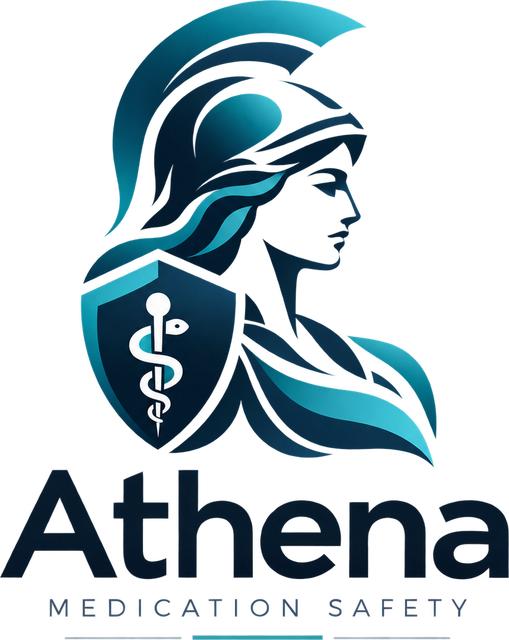
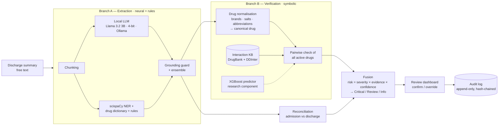
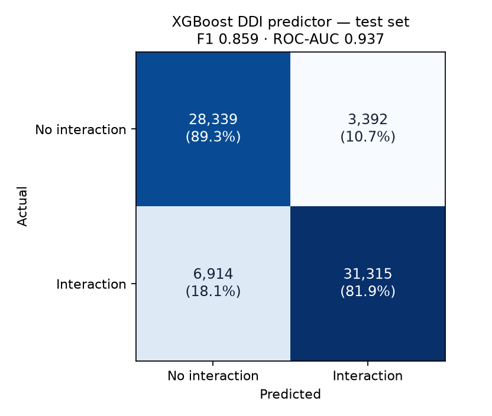

<p align="center"></p>

<h1 align="center">Athena</h1>

<p align="center"><b>Neuro-Symbolic Medication Safety: Fusing Local LLM Extraction with Verified Drug-Interaction Reasoning</b></p>

<p align="center">
Minor Project [ARP 455] · B.Tech AIML, 7th Semester · USAR, GGSIPU East Delhi Campus<br>
Siddhant Gahlot
</p>

---

## Overview

Athena is a clinical decision-support prototype for **medication reconciliation**. Given a hospital discharge summary, it

1. **extracts** every medication with its dose, route, frequency and status, using a local language model plus deterministic rules;
2. **reconciles** the admission and discharge medication lists (omissions, new medications, dose changes);
3. **verifies** every pair of active medications against curated drug-interaction databases;
4. **fuses** extraction confidence and interaction evidence into a tiered, explainable report; and
5. lets a **pharmacist confirm or override** each finding, with every decision written to a tamper-evident audit log.

It runs **entirely on a laptop** (Apple M2, 8 GB, no GPU). No patient text leaves the device.

### Key results

| What | Result |
|---|---|
| Medication extraction — n2c2 2018 Track 2, held-out test | **micro F1 0.794 strict / 0.878 lenient** (Drug F1 0.866) — scispaCy baseline 0.344 |
| ML interaction predictor (XGBoost) — DrugBank benchmark test | **F1 0.859 · accuracy 0.853 · ROC-AUC 0.937** — logistic-regression baseline F1 0.843 |
| Interaction knowledge base | 2,421 drugs · 311,187 interacting pairs (DrugBank + DDInter), with severity |
| Speed / memory | Interaction check 7 ms per patient · ~3.8 GB peak RAM |
| Quality | 114 automated tests |

---

## The problem

Medication errors at transitions of care (admission, transfer, discharge) are among the most common preventable causes of patient harm. Existing automation falls into two camps, each with a failure mode:

| Approach | Strength | Failure mode |
|---|---|---|
| Rule / database lookup | Precise, auditable | Cannot read free-text clinical notes (brand names, abbreviations, "held") |
| LLM only | Reads free text fluently | Hallucinates drugs and interactions, over-flags, not auditable |
| **Athena (neuro-symbolic)** | **The LLM reads; verified databases decide; a human confirms** | Each component is used only for what it is good at |

**Core rule:** the language model is used **only for extraction**. It never decides whether an interaction exists or how dangerous it is. Every interaction flag is traceable to a database record.

---

## How Athena works



---

## Components and files

### Branch A — Medication extraction

Extraction is a **span-classification (NER) task**: each span of text is labelled Drug, Strength, Dosage, Route, Frequency, Duration or Form, and every attribute is linked to its drug. Athena uses an **ensemble of three classifiers** combined by per-field rules chosen on the validation set:

| Component | Role |
|---|---|
| **Llama 3.2 3B Instruct** (4-bit, local via Ollama) | Prompted extraction into fixed 8-field rows (JSON-schema-constrained, temperature 0) |
| **scispaCy** `en_ner_bc5cdr_md` | Pre-trained biomedical NER — drug mentions and cross-check |
| **Rule-based classifier** | Drug dictionary (KB + RxNorm names, abbreviations) and regex patterns for dose, route, frequency |
| **Grounding guard** | Every value must be found verbatim in the note; anything the LLM invents is discarded |

| File | Purpose |
|---|---|
| `athena/extraction/llm_extractor.py` | Local LLM client, compact JSON schema, on-disk cache |
| `athena/extraction/prompts/extract_v1.txt` | Extraction prompt |
| `athena/extraction/chunking.py` | Splits long notes into overlapping chunks |
| `athena/extraction/align.py` | Grounding guard: locates every value in the note text |
| `athena/extraction/slot_repair.py` | Fixes column-shifted LLM rows |
| `athena/extraction/rules.py` | Drug dictionary, lab-section mask, attribute patterns |
| `athena/extraction/scispacy_extractor.py` | scispaCy drug mentions |
| `athena/extraction/pipeline.py` | Ensemble; modes `hybrid` · `llm` · `rules` · `scispacy`; automatic rules-only fallback |
| `athena/eval/n2c2_metrics.py` | n2c2 scorer: strict / lenient precision, recall, F1 per type; relation F1 |

### Drug normalisation

Maps what clinicians write (`"ASA 81"`, `"Lasix"`, `"metoprolol tartrate"`, `"Percocet"`) to canonical drugs: abbreviation and brand dictionary → salt / formulation stripping → combination splitting → strict fuzzy matching. Drug classes ("antibiotics") and non-drugs (fluids, blood products) are recognised and shown as *not checked*, never silently dropped. Coverage: **87%** of specific drug mentions in n2c2, **91%** of MIMIC-III prescription rows.

| File | Purpose |
|---|---|
| `athena/normalize/lexicon.py` | ~20k-string lexicon from DrugBank, DDInter, Wikidata (linked by DrugBank ID) and RxNorm |
| `athena/normalize/normalizer.py` | Ordered deterministic matcher with match stage and score |

### Branch B — Interaction verification

**Knowledge base (symbolic).** DrugBank and DDInter merged into one SQLite database: 2,421 drug concepts, 311,187 interacting pairs. DDInter supplies severity grades (Major / Moderate / Minor); for DrugBank-only pairs, severity is **derived from data** per mechanism template (e.g. QTc-prolongation pairs are graded Major by DDInter 93% of the time) and labelled *derived*. Every active pair gets exactly one result: **interaction**, **no known interaction**, or **not covered** — "not covered" is never reported as "safe". Duplicate therapy (e.g. Percocet + Tylenol) is also detected.

**ML interaction predictor (research component).** Following Shtar et al. (2019), an **XGBoost** classifier predicts whether a drug pair interacts from graph-similarity features (common neighbours, Jaccard, Adamic–Adar, resource allocation, degrees) computed on the training interaction graph only. It is evaluated on the standard DrugBank benchmark split and is **not** used to raise flags in the dashboard — predictions are never presented as verified.

| File | Purpose |
|---|---|
| `athena/verification/kb_build.py` | Builds the interaction KB, merges drug variants, derives severity |
| `athena/verification/checker.py` | Pairwise checker with evidence |
| `athena/verification/ddi_predictor.py` | Graph-similarity features for the XGBoost predictor (leakage-safe) |
| `scripts/train_ddi_xgboost.py` | Trains and evaluates the predictor; classification report + confusion matrix |

### Fusion and reconciliation

| File | Purpose |
|---|---|
| `athena/fusion/sections.py` | Finds the admission and discharge medication lists |
| `athena/fusion/report.py` | Medication list and status, reconciliation, risk scoring, tiers, explanations, report hash |

```
risk       = severity × evidence × min(extraction confidence of the two drugs)
tiers      : Critical ≥ 0.7 · Review ≥ 0.5 · Info < 0.5
safety     : a Major interaction is never placed below Review
```

### Human review

| File | Purpose |
|---|---|
| `app/streamlit_app.py` | Review dashboard: input, findings, reconciliation, medication record, audit log |
| `app/ui/theme.py` | Design system (tokens, typography, components) |
| `athena/review/audit.py` | Append-only, hash-chained audit log (edits and deletions are rejected) |

The dashboard follows progressive disclosure: each finding shows *what, why, how serious* and the actions; evidence (sources, mechanism, confidence, risk arithmetic) is one click away.

### Data loaders and configuration

| File | Purpose |
|---|---|
| `athena/data/n2c2.py`, `mimic.py`, `drugbank.py`, `ddinter.py` | Dataset loaders |
| `configs/default.yaml` | Model, chunking, fusion weights and thresholds |

---

## Results

### 1. Medication extraction — n2c2 2018 Track 2

Held-out test set (first 35 of 202 test notes, scored once after all tuning on a separate validation split; every mode on the same notes). Micro-averaged over 7 entity types.

| Mode | Strict P / R / F1 | Lenient P / R / F1 | Drug F1 | Relation F1 |
|---|---|---|---|---|
| scispaCy (baseline) | .938 / .211 / .344 | .987 / .222 / .362 | .707 | — |
| LLM only | .827 / .547 / .659 | .922 / .610 / .734 | .768 | .542 |
| Rules only | .840 / .723 / .777 | .936 / .805 / .866 | .842 | .658 |
| **Athena hybrid** | **.834 / .758 / .794** | **.923 / .838 / .878** | **.866** | **.697** |

Per type (hybrid, strict F1): Drug .866 · Route .875 · Strength .847 · Dosage .694 · Form .686 · Frequency .666 · Duration .485.
Validation F1 (.792) matches test (.794), indicating no overfitting to the tuning set. Full tables: `docs/results/extraction_test_35notes.json`, `docs/results/extraction_val_38notes.json`.

### 2. ML interaction predictor — XGBoost

Binary classification (interaction / no interaction), DrugBank DDI benchmark (DeepDDI), warm-start split; 280,347 training and 69,960 test pairs (benchmark negatives, 1:1 per positive).

```
                precision    recall  f1-score   support
no interaction      0.804     0.893     0.846     31731
   interaction      0.902     0.819     0.859     38229
      accuracy                          0.853     69960

ROC-AUC 0.937 · PR-AUC 0.950 · logistic-regression baseline: F1 0.843, ROC-AUC 0.911
```

<p></p>

Most informative features: resource allocation, Adamic–Adar and Jaccard similarity. Full results: `docs/results/ddi_xgboost.json`.

### 3. System-level

| Measure | Result |
|---|---|
| Drug-name coverage | 87% of specific n2c2 drug mentions; 91% of MIMIC-III prescription rows |
| Interaction check speed | 7 ms per patient (122 MIMIC-III admissions in 0.8 s) |
| Alert volume (MIMIC-III) | median 49 recorded interacting pairs per patient, ~1 Major — tiering keeps the reviewer's list short |
| Grounding guard | 48% of LLM attribute values rejected as unsupported by the note text |
| Memory | ~3.8 GB peak (model 2.3 GB on Metal + pipeline) |

---

## Synopsis objectives

| Objective | Status | Evidence |
|---|---|---|
| Two-branch architecture separating LLM extraction from deterministic verification | ✅ | Branch A (`athena/extraction/`) · Branch B (`athena/verification/`) |
| Confidence-weighted fusion into a single, explainable risk output | ✅ | `athena/fusion/report.py`; every finding shows its evidence and risk arithmetic |
| Runs locally on consumer hardware (8 GB) without cloud dependency | ✅ | Local Ollama model; ~3.8 GB peak; no network calls |
| Human-in-the-loop review with auditable confirm / override | ✅ | Dashboard + hash-chained audit log |
| Evaluate against extraction benchmarks and document limitations | ✅ (subset) | n2c2 held-out test (35 notes; full set in progress); `docs/limitations.md` |

---

## Design principles

- **The LLM reads, databases decide.** No interaction claim comes from the language model.
- **Grounded output.** Extracted values must exist in the note; invented values are dropped.
- **Unknown is not safe.** Drugs or pairs outside the knowledge base are shown as *not checked / not covered*.
- **Major is never hidden.** Low extraction confidence changes how a Major interaction is presented, not whether it is shown.
- **Human decides, everything is logged.** Overrides require a reason; the audit log is append-only and tamper-evident.
- **Private by construction.** Local model, local databases, no telemetry; demo notes are synthetic.

---

## Data

| Dataset | Use |
|---|---|
| **n2c2 2018 Track 2** (303 train / 202 test discharge summaries) | Extraction training and gold-standard evaluation — obtained via a research mirror; official DBMI access in progress |
| **MIMIC-III Clinical Database Demo** (100 patients) | Real medication lists for interaction-check testing |
| **DrugBank** DDI extract + DeepDDI benchmark | Interaction knowledge base; XGBoost predictor benchmark |
| **DDInter** | Interaction severity grades; biologics coverage |
| **RxNorm** (NLM) and **Wikidata** | Drug synonyms, brands, salt forms, DrugBank IDs |
| **FDA FAERS** (2026 Q2) | Reserved for a supporting real-world signal |

Raw data is not included in this repository (licences and data-use agreements). The dashboard's demo patients (`data/demo/`) are fictional.

---

## Running Athena

```bash
# one-time setup (macOS)
brew install ollama libomp
ollama pull llama3.2:3b
uv venv --python 3.11 .venv && source .venv/bin/activate
uv pip install -r requirements.txt

# build the drug lexicon and interaction knowledge base (needs data/raw/)
python scripts/build_lexicon.py
python scripts/build_kb.py

# run
brew services start ollama
streamlit run app/streamlit_app.py               # dashboard → http://localhost:8501
python scripts/run_pipeline.py data/demo/01_af_pneumonia.txt --mode rules   # report in the terminal
python scripts/check_meds.py "coumadin 5 mg" "ASA 81" "Lasix 40"            # interaction check only

# reproduce results
python scripts/eval_extraction.py test --limit 40   # n2c2 extraction F1 (uses cached LLM output)
python scripts/train_ddi_xgboost.py                 # XGBoost predictor: report + confusion matrix
pytest                                              # 114 tests
```

---

## Repository structure

```
athena/                 core package
├── data/               dataset loaders (n2c2, MIMIC-III, DrugBank, DDInter)
├── normalize/          drug lexicon + normaliser
├── extraction/         Branch A: LLM, rules, scispaCy, grounding, ensemble
├── verification/       Branch B: knowledge base, checker, XGBoost predictor
├── fusion/             sections, reconciliation, risk and tiers, report
├── review/             audit log
└── eval/               n2c2 scorer
app/                    Streamlit dashboard (+ design system, logo, local fonts)
scripts/                build, evaluate, train and command-line tools
configs/default.yaml    all tunable settings
tests/                  114 automated tests
docs/                   results and limitations
data/demo/              synthetic demo patients
```

---

## Limitations and next steps

Key limitations (full list in [`docs/limitations.md`](docs/limitations.md)):

- Some classic dangerous combinations that exist only in DrugBank under generic templates are under-rated (e.g. sertraline + tramadol); a cited high-alert rule layer is the next step.
- On n2c2's highly regular medication lists, the rules alone nearly match the hybrid; the LLM's gain is in narrative text — fine-tuning is planned.
- Extraction test results cover 35 of 202 test notes so far; the full run is scheduled.
- Topical and systemic routes are not yet distinguished (e.g. a lidocaine patch is checked as systemic lidocaine).
- The XGBoost predictor is evaluated in the warm-start setting only and is not surfaced as verified evidence.
- Athena does not learn automatically from overrides — by design; a governed, offline improvement loop is planned.

Planned work: high-alert combination rules · synthetic training data · LoRA fine-tuning of the local model · cold-start and structure-based interaction prediction · fusion calibration · full evaluation and report.

---

## References

1. Henry et al. (2020). 2018 n2c2 shared task on ADEs and medication extraction in EHRs. *JAMIA* 27(1).
2. Ju et al. (2020). An ensemble of neural models for nested ADE and medication extraction with subwords. *JAMIA* 27(1).
3. Christopoulou et al. (2020). ADE and medication relation extraction with ensemble deep learning. *JAMIA* 27(1).
4. Kim, Oh & Jeong (2026). LLMs in ADR detection and pharmacovigilance: a systematic review. *Diagnostics* 16(15).
5. Yao, Rao & Padman (2025). Analytical approaches for medication reconciliation: a scoping review. *medRxiv*.
6. Ong et al. (2025). Generative AI and LLMs in mitigating medication-related harm: a scoping review. *npj Digit. Med.* 8.
7. Wiest et al. (2024). Privacy-preserving LLMs for structured medical information retrieval. *npj Digit. Med.* 7.
8. Kim, Kim & Choi (2026). Local small language models and ML for extraction and outcome prediction. *CSBJ* 35(2).
9. Shtar, Rokach & Shapira (2019). Detecting drug-drug interactions using ANNs and classic graph similarity measures. *PLOS ONE* 14(8).
10. Gupta, Laghuvarapu & Priyakumar (2024). GraphDDI: graph neural network for DDI prediction. *AIiH 2024, LNCS* 14975.

Data: DDInter (Xiong et al., *Nucleic Acids Res.* 2022) · MIMIC-III Demo (Johnson et al., PhysioNet) · DeepDDI DrugBank benchmark (Ryu et al., *PNAS* 2018) · RxNorm (U.S. National Library of Medicine) · Wikidata (CC0).

*Built with Llama (Llama 3.2 Community License). Research prototype for decision support — not a medical device.*
