# Athena

**Neuro-Symbolic Medication Safety: Fusing Local LLM Extraction with Verified Drug-Interaction Reasoning**

Minor Project [ARP 455] · B.Tech AIML, 7th Semester · USAR, GGSIPU East Delhi Campus
Author: Siddhant Gahlot · Synopsis: `Minor_Project_Synopsis (2).docx`

> **Status (4 Oct 2026):** datasets acquired, design frozen for v1, **Phase 1 complete — Batches 0–6** (setup, data, normaliser, interaction KB, checker, extraction, fusion, dashboard + audit log).
> **Next milestone:** working base pipeline demo on **7 Oct 2026**.
> **Final evaluation:** 24 Nov 2026 (buffer for report/paper into early December).

---

## 1. What Athena does

Athena assists **medication reconciliation**: given a patient's unstructured clinical text (e.g. a discharge summary), it

1. **extracts** every medication with its strength, dose, route, frequency and status (active / held / stopped),
2. **verifies** every pair of active medications against curated drug-interaction databases,
3. **fuses** extraction confidence and interaction evidence into a single, explainable risk report, and
4. **presents** that report to a pharmacist, who confirms or overrides each item — with every decision written to an audit log.

It runs **entirely on a laptop** (8 GB unified memory, no dedicated GPU). No patient text leaves the machine at inference time.

### Why this design

| Approach | Strength | Failure mode |
|---|---|---|
| Rule / database lookup only | Precise, auditable | Cannot read free text; misses context ("held", brand names, abbreviations) |
| LLM only | Reads free text fluently | Hallucinates drugs and interactions; over-flags; not auditable |
| **Athena (hybrid)** | LLM reads, database decides | Each component is used only for what it is good at |

**Core rule:** the LLM is used **only for extraction**. It never decides whether an interaction exists or how dangerous it is. Every interaction flag Athena shows must be traceable to a database record (or, later, to an explicitly labelled *predicted / unverified* model score).

---

## 2. System design

```mermaid
flowchart LR
    T[Clinical note<br/>free text] --> A1

    subgraph A[Branch A — Extraction &#40;neural&#41;]
        A1[Section split<br/>+ chunking] --> A2[Local LLM<br/>Llama 3.2 3B Q4 via Ollama<br/>JSON-schema output]
        A1 --> A3[scispaCy NER<br/>fallback / cross-check]
        A2 --> A4[Span alignment<br/>+ merge]
        A3 --> A4
    end

    A4 --> N[Drug normalisation<br/>salts · abbreviations · brands · synonyms<br/>→ canonical drug ID]

    subgraph B[Branch B — Verification &#40;symbolic&#41;]
        N --> B1[Pairwise check<br/>all active-drug pairs]
        KB[(Interaction KB<br/>DrugBank + DDInter<br/>SQLite)] --> B1
        B1 --> B2[Evidence record per pair<br/>sources · mechanism · severity · coverage]
    end

    A4 -- extraction confidence --> F
    B2 -- evidence --> F[Fusion layer<br/>confidence-weighted risk score<br/>+ tier + explanation]
    F --> UI[Streamlit review dashboard<br/>pharmacist confirm / override]
    UI --> LOG[(Append-only audit log<br/>SQLite)]
```



### 2.1 Branch A — Extraction (LLM, extraction only)

| Item | Decision (v1) |
|---|---|
| Model | **Llama 3.2 3B Instruct, Q4_K_M** via Ollama (~2 GB). Phi-3-mini as comparison model. |
| Output | Strict JSON schema (Ollama `format=`), temperature 0. One object per medication: `drug`, `strength`, `dosage`, `route`, `frequency`, `duration`, `form`, `status`, `evidence_text`. |
| Long notes | Split by section headers, then chunk to fit a ~4k-token context with overlap; de-duplicate across chunks. |
| Grounding | Every extracted value must be found verbatim (or near-verbatim) in the source text → gives character offsets for n2c2 scoring and highlighting in the UI. Values that cannot be located are **dropped** (anti-hallucination guard). |
| Fallback / cross-check | scispaCy (`en_core_sci_md` + `en_ner_bc5cdr_md`) for drug mentions. LLM–scispaCy agreement feeds extraction confidence. If Ollama is unavailable, scispaCy + rules run alone. |
| Rules ensemble (Batch 4) | Deterministic drug dictionary (KB + RxNorm names, abbreviations, classes), lab-section mask, regex attribute finder per drug window, slot repair for column-shifted LLM rows. Hybrid precedence chosen on the **validation** split: LLM first for Strength/Frequency, rules first for Route/Form, rules only for Dosage/Duration. |
| Modes | `scispacy` (baseline) · `llm` · `rules` (no LLM — automatic fallback when Ollama is down) · `hybrid` (default) |
| Out of scope (v1) | `Reason` and `ADE` entities from n2c2 (kept for later; not needed for reconciliation v1). |

**n2c2 validation (38 notes), micro F1 over 7 types, strict / lenient:** scispaCy .337/.362 · LLM-only .622/.693 · rules-only .775/.863 · **hybrid .792/.870** (Drug .860/.916). Full tables: `docs/results/extraction_val_38notes.json`.

**n2c2 test — held-out, scored once after freezing (first 35 test notes by ID; same notes for every mode):**

| Mode | Strict P / R / F1 | Lenient P / R / F1 | Drug F1 (strict) | Relations F1 (strict) |
|---|---|---|---|---|
| scispaCy | .938 / .211 / .344 | .987 / .222 / .362 | .707 | — |
| LLM only | .827 / .547 / .659 | .922 / .610 / .734 | .768 | .542 |
| Rules only | .840 / .723 / .777 | .936 / .805 / .866 | .842 | .658 |
| **Hybrid** | **.834 / .758 / .794** | **.923 / .838 / .878** | **.866** | **.697** |

Test ≈ validation (.794 vs .792 strict), so the validation tuning did not overfit. Full tables: `docs/results/extraction_test_35notes.json`. The remaining 167 test notes need ≈ 3–4 h of LLM time and will be run before the final evaluation.

### 2.2 Drug normalisation (deterministic)

Maps raw strings (`"metoprolol tartrate"`, `"ASA"`, `"Lasix"`, `"vancomycin hcl"`) to a canonical drug ID shared by all knowledge sources.

Pipeline: drug-class / non-drug check → abbreviation & brand dictionary → exact lookup → remove brackets & doses → strip salt/formulation words (after the first token) → split combinations → typo-tolerant fuzzy match (same first 4 letters) → otherwise **`UNMAPPED`**.

Lexicon (`scripts/build_lexicon.py` → `data/processed/drug_lexicon.json`): 2,442 canonical KB drugs, ~20k surface strings from DrugBank, DDInter, Wikidata aliases and RxNorm salts/brands.

Statuses: `mapped` · `ambiguous` · `drug_class` (e.g. "antibiotics" — shown, not checkable) · `non_drug` (fluids, blood products, supplies) · `unmapped`.

Coverage (Batch 2a): **87%** of specific-drug mentions in n2c2 (train 86.9%, untouched test 87.3%); **91%** of MIMIC-demo prescription rows that are drugs (excl. fluids/supplies).
The match type and score are part of the extraction confidence. Unmapped drugs are **shown to the pharmacist**, never silently dropped.

### 2.3 Branch B — Verification (symbolic)

**Interaction knowledge base** (built once, stored as SQLite):

| Source | Gives us | Notes |
|---|---|---|
| DrugBank DDI extract (Kaggle, `db_drug_interactions.csv`) | 191,541 pairs, 1,701 drugs, 86 mechanism templates | No severity. Small-molecule only. ~2017 snapshot. |
| DrugBank benchmark (`jcsun-00/DrugBank`) | DrugBank IDs, SMILES, 86 type labels, standard splits | Same pairs as above; used for IDs and for the similarity model (later batch). |
| DDInter (`ddinter_downloads_code_*.csv`) | Pairwise **severity**: Major / Moderate / Minor / Unknown; covers biologics (e.g. heparin) | **Added beyond synopsis** — needed because free DrugBank has no severity. |
| FAERS 2026 Q2 | Real-world co-report counts | Optional supporting signal (later batch), never a sole basis for a flag. |

For each pair of **active** medications the checker returns one of:

| Result | Meaning |
|---|---|
| `INTERACTION` | Found in ≥1 source → mechanism, severity, sources listed |
| `NO_KNOWN_INTERACTION` | Both drugs covered by the KB, no record found |
| `NOT_COVERED` | At least one drug is missing from the KB → **"unknown", not "safe"** |

Also reported by the checker: **`DUPLICATE_THERAPY`** (same drug concept in two medications, e.g. Percocet + Tylenol → acetaminophen twice), **unchecked medications** (drug classes, unmapped, ambiguous — shown, never dropped), and **inactive** medications (held/stopped — not paired). Components of one combination product are not paired with each other.

Interaction severity: DDInter grade if Major/Moderate/Minor → else most severe *derived* DrugBank template → else DDInter `Unknown`. Each result carries sources, DDInter level, the original DrugBank sentence(s) and the template evidence.

```bash
python scripts/check_meds.py "coumadin 5 mg" "ASA 81" "Lasix 40" "Percocet" "tylenol" "simvastatin:held"
```

Performance (Batch 3): all 122 MIMIC-demo admissions (drugs active on the last day) in 0.8 s — **7 ms per patient**. Per patient: median 17 medications, 78 pairs, 49 interactions of which **1 Major**, 16 Moderate, 22 `Unknown`.

**Severity taxonomy:** DDInter levels `Major > Moderate > Minor > Unknown`. When only DrugBank has the pair, severity is **derived from data**: for each of the 86 DrugBank mechanism templates, look at pairs that DDInter also grades — `Major` if ≥ 50% of them are Major, `Minor` if ≥ 50% Minor, otherwise `Moderate`; `Unknown` if fewer than 10 graded overlapping pairs. Result: 10 Major templates (e.g. QTc-prolongation risk 93% Major, serotonergic 91%, respiratory depression 100%), 51 Moderate, 1 Minor, 24 Unknown. Each derived severity is stored with its evidence (`template_severity` table) and marked `derived`.

**KB build (Batch 2b):** `python scripts/build_kb.py` → `data/processed/interactions.db` (SQLite, ~70 MB): 2,421 drug concepts, 311,187 interacting pairs (37,680 in both sources, 152,807 DrugBank-only, 120,700 DDInter-only). Salt and insulin-type variants are merged into one concept (reviewed allow-list); **route-specific entries** (e.g. `timolol (ophthalmic)`) are kept separate because their systemic interaction profile differs.

**Alert-volume finding:** on MIMIC-demo, drugs active together on the last hospital day give a median of 13 drugs → **49 interacting pairs but ~1 Major** per patient. Showing every KB hit would cause alert fatigue; the fusion tiers (§2.4) are what keep the pharmacist's list short.

### 2.4 Fusion layer (Batch 5)

`athena.fusion.report.analyze(note_text) -> Report` (CLI: `python scripts/run_pipeline.py --n2c2 train:100035`)

1. **Sections:** "Medications on Admission" / "Discharge Medications" located (234 / 265 train notes have both). `Sig:` lines never end a section.
2. **Medication list:** mentions grouped per drug concept. Status: `active` if on the discharge list; `held`/`stopped` if the LLM or a deterministic cue ("held", "discontinued" in the same sentence) says so; otherwise `mentioned` (narrative only — not paired). Without a discharge list, all non-held drugs are treated as active (over-flagging, with a warning).
3. **Reconciliation:** admission vs discharge → `OMISSION` (Review if unexplained, Info if held/stopped is stated), `NEW_MEDICATION` (Info), `DOSE_CHANGE` (Review).
4. **Checker** (Branch B) on active drugs → `INTERACTION`, `DUPLICATE_THERAPY`, `NOT_CHECKED`, `NOT_COVERED`.
5. **Risk and tier** for interactions:

```
risk       = S(severity) × E(evidence) × min(conf_a, conf_b)
S          : Major 1.0 · Moderate 0.6 · Minor 0.3 · Unknown 0.25 · ×0.8 if severity is derived
E          : 1.0 if DrugBank and DDInter both have the pair, else 0.85
conf_drug  = 0.4 detection agreement (LLM+rules 1.0 … single rule 0.75)
           + 0.4 normalisation score
           + 0.2 status certainty (on discharge list 1.0, inferred 0.6)
tiers      : Critical ≥ 0.7 · Review ≥ 0.5 · Info < 0.5      (configs/default.yaml)
```

**Safety override:** a `Major` interaction is never below Review; if its risk is below Critical it is flagged *"verify extraction"*. Low confidence changes how an item is presented, never whether a dangerous item is shown.

Every finding carries its explanation (note text → canonical drug, DDInter grade, DrugBank sentences, derived-severity evidence, the risk arithmetic) and the report carries a SHA-256 hash for the audit log. Weights and thresholds are v1 settings; calibration on synthetic planted-interaction patients is Batch 12.

### 2.5 Human-in-the-loop review (Batch 6)

```bash
streamlit run app/streamlit_app.py        # http://localhost:8501
# demo shortcuts: /?demo=1&mode=rules&reviewer=Your%20Name   (demo=1..3)
```

**Dashboard** (Streamlit, local-only, telemetry off, fonts served from `app/static`):

- **Review** — choose a synthetic demo patient, paste or upload a note → KPI tiles (Critical / Review / Info / active meds / pairs checked) → finding cards per tier with tier badge (icon + label, never colour alone), evidence chips (DDInter / DrugBank / *severity derived*), the plain-language explanation and the risk arithmetic → **Confirm** / **Override** (reason code required; "Other" needs a comment). Side tabs: medication table (status, admission/discharge lists, confidence), the note with extracted drugs highlighted (critical ones in red), run details (mode, model, timing, sections, report hash). Info findings are collapsed, never hidden.
- **Audit log** — every decision as an append-only, hash-chained row (`athena/review/audit.py`): SQLite triggers reject UPDATE/DELETE, each row stores the hash of the previous row and of the report reviewed; the page verifies the chain on load and exports CSV.
- **About** — architecture and safety principles for demos.

Design system from *ui-ux-pro-max* (clinical decision support → Swiss minimal, dense dashboard): slate canvas, single teal accent, semantic tier colours with icons, Figtree headings + Atkinson Hyperlegible body, Lucide icons, WCAG-AA contrast, visible focus, reduced-motion respected.

Synthetic demo notes in `data/demo/` are fictional and safe to screen-share; real n2c2/MIMIC notes must not be shown to third parties (data-use agreements).

---

## 3. Data

All raw data lives in `data/raw/` and is **git-ignored**. It must never be committed or uploaded.

| Dataset | Location | Content | Role | Provenance / caveats |
|---|---|---|---|---|
| **n2c2 2018 Track 2** | `data/raw/n2c2_2018_track2/` | 303 train (265 + 38 val) + 202 test notes, BRAT `.txt/.ann` | Branch A training & **evaluation (gold standard)** | Unofficial copy from `varunchaudharycs/biomedical_ner`. Official DBMI access to be obtained; 38-note val split is author-defined. |
| **MIMIC-III Clinical Database Demo v1.4** | `data/raw/mimic_iii_demo/` | 26 tables, 100 patients; `PRESCRIPTIONS` = 10,398 rows, 122 admissions, 573 drug names | Real medication lists for Branch B testing and synthetic-note seeds | Open access (ODbL). `NOTEEVENTS` is empty in the demo. Full MIMIC-III not required. |
| **DrugBank DDI extract** | `data/raw/drugbank_kaggle/` | Drug 1, Drug 2, description | Interaction existence + mechanism | Kaggle redistribution of the DeepDDI DrugBank benchmark; version unknown. Swap in official DrugBank 5.1.x when licence/download works. |
| **DrugBank benchmark** | `data/raw/drugbank_benchmark/` | DrugBank IDs, SMILES, 86 types, warm/cold-start splits | IDs, similarity model, comparable benchmark | From `jcsun-00/DrugBank` (HDN-DDI paper). |
| **DDInter** | `data/raw/ddinter/` | Drug pairs with severity level, split by ATC code (A, B, D, H, L, P, R, V) | Severity + biologics coverage | Added beyond synopsis. 160,235 unique pairs, 1,939 drugs (files overlap across ATC codes). Levels: Moderate 59% · Unknown 21% · Major 15% · Minor 5%. |
| **FDA FAERS 2026 Q2** | `data/raw/faers/ASCII/` | 422,459 reports; DRUG, REAC, OUTC, INDI, THER, DEMO, RPSR tables | Optional real-world signal | One quarter only. Exclude IDs in `Deleted/DELETE26Q2.txt`. |
| **Wikidata (DrugBank IDs)** | `data/raw/wikidata/drugbank_ids.csv` | 15,405 items: DrugBank ID, English label, aliases, RxCUI (SPARQL, 4 Oct 2026) | Drug synonyms; DrugBank name↔ID mapping | CC0. Aliases linked only via matching DrugBank ID; loose aliases filtered (audit in `athena/normalize/lexicon.py`). |
| **RxNorm Prescribable Content** | `data/raw/rxnorm/` | Release 08 Sep 2026: ingredients, salt forms, brand names + relations | Salt/brand → ingredient normalisation | NLM, free, no UMLS licence needed. |

### 3.1 Synthetic data (Option A + B)

Purpose: more and harder training/test examples for **Branch A**, and planted-interaction patients for **end-to-end evaluation**.

| Generator | How | Use |
|---|---|---|
| **A — templates & rules** (local Python) | Real MIMIC-demo medication lists → sentence templates with abbreviations, brand names, misspellings, held/stopped/changed drugs. Labels and offsets known by construction. | Volume, edge cases |
| **B — Claude-written notes** (development time only) | Claude writes realistic discharge-summary passages from MIMIC-demo medication lists. Offsets recovered and **validated by code**; any note whose labels don't align is discarded. | Natural language variety |

**Rules:**
- Synthetic data is **never** used as the final test set; headline results are on the **real n2c2 test set** only.
- **No n2c2 text is ever sent to a cloud model** (data-use agreement). Generator B is seeded only from open MIMIC-demo data.
- Results are reported **with and without** synthetic data, and real vs. synthetic scores are reported separately.
- Synthetic data is **never** used to create interaction facts. Branch B knowledge comes only from the databases above.
- Use of a cloud model for dev-time data generation is declared in the report.

---

## 4. Evaluation plan

| What | Data | Metric |
|---|---|---|
| Medication extraction (Branch A) | n2c2 2018 Track 2 **test** (202 notes) | Strict & lenient entity-level P/R/F1 per type (Drug, Strength, Dosage, Route, Frequency, Duration, Form); attribute→drug relation F1 |
| Normalisation | Hand-checked sample of MIMIC-demo drug names | Mapping accuracy, % unmapped |
| KB coverage | MIMIC-demo admissions | % drugs covered, % pairs `NOT_COVERED` |
| End-to-end safety | Synthetic patients with planted interactions | Major-interaction sensitivity (missed dangers), false alarms per patient, review burden (items shown per patient) |
| Resource use | Laptop (Apple M2, 8 GB) | Peak RAM, seconds per note |
| Ablations (later) | n2c2 test | LLM only vs scispaCy only vs hybrid; ± synthetic data; ± fine-tuning; Llama 3.2 3B vs Phi-3-mini |

Limitations are documented honestly in `docs/limitations.md` as they are found.

---

## 5. Implementation batches

Work is done in small, self-contained batches. Each batch ends with something runnable and tested.

### Phase 1 — Base system (target: **demo on 7 Oct 2026**)

| Batch | When | Deliverable | Done when |
|---|---|---|---|
| **0 — Setup** | 4–5 Oct | Repo layout, Python 3.11 venv, `requirements.txt`, `.gitignore`, config file, Ollama + model pulled | `pytest` runs; `ollama run llama3.2:3b` responds |
| **1 — Data loaders** | 5 Oct | n2c2 BRAT reader (from zips), MIMIC `PRESCRIPTIONS` loader, DrugBank / DDInter / benchmark loaders | Unit tests: 303/202 notes, entity counts, 191k pairs load |
| **2 — Normalisation + KB** | 5 Oct | Drug normaliser; SQLite interaction KB merging DrugBank + DDInter with severity and coverage; template→severity map | Known pairs found (warfarin–aspirin, simvastatin–clarithromycin, heparin–ketorolac); MIMIC coverage report |
| **3 — Branch B checker** | 5–6 Oct | Pairwise checker returning `INTERACTION` / `NO_KNOWN_INTERACTION` / `NOT_COVERED` with evidence | Runs on every MIMIC-demo admission; tests pass |
| **4 — Branch A extractor** | 6 Oct | Ollama JSON-schema extraction, chunking, span grounding, scispaCy cross-check, n2c2 scorer | **Baseline F1 on n2c2 test** (zero/few-shot, no fine-tuning) |
| **5 — Fusion + report** | 6 Oct | Confidence components, risk score, tiers, explanations | End-to-end JSON report for a note |
| **6 — Dashboard + audit** | 6–7 Oct | Streamlit review UI, confirm/override with reason codes, SQLite audit log | Live demo: paste note → report → review → audit row written |
| **Demo prep** | 7 Oct | Demo script, 3–5 showcase notes (synthetic + n2c2 train), baseline numbers slide | — |

**"Base model" for 7 Oct = the complete pipeline working end to end with a non-fine-tuned LLM and first baseline numbers.** Fine-tuning and synthetic-data training come after.

### Phase 2 — Improve (8 Oct – 31 Oct)

| Batch | Deliverable |
|---|---|
| **7 — Synthetic data A** | Template generator + validator; edge-case suite (abbreviations, brands, held/stopped, dose changes) |
| **8 — Synthetic data B** | Claude-written notes from MIMIC-demo med lists, validated and versioned in `data/synthetic/` |
| **9 — Fine-tuning** | LoRA fine-tune of the 3B model (MLX on Apple Silicon) on n2c2 train + synthetic; export back to GGUF for Ollama; compare vs baseline |
| **10 — Similarity model** | Shtar-style DDI predictor (graph/structure similarity + XGBoost/LightGBM) for pairs not in the KB — shown only as *predicted / unverified* |
| **11 — FAERS signal** | Co-report statistics as an extra, clearly labelled evidence feature |
| **12 — Fusion tuning** | Calibrate weights/thresholds on synthetic planted-interaction patients |

### Phase 3 — Evaluate & write (1 Nov – 24 Nov, buffer to mid-Dec)

| Batch | Deliverable |
|---|---|
| **13 — Full evaluation** | All metrics in §4, ablations, resource measurements |
| **14 — Report** | Final report, limitations, figures |
| **15 — Paper** | Short paper draft (if results justify it) |

---

## 6. Repository layout (planned)

```
minor/
├── README.md
├── requirements.txt
├── .gitignore                 # data/raw, data/processed, *.db, models
├── configs/
│   └── default.yaml           # model name, chunk size, fusion weights, thresholds, paths
├── athena/
│   ├── data/                  # n2c2.py, mimic.py, drugbank.py, ddinter.py, faers.py
│   ├── normalize/             # drug-name normaliser, abbreviation & salt lists
│   ├── extraction/            # llm_extractor.py, scispacy_extractor.py, align.py, prompts/
│   ├── verification/          # kb_build.py, checker.py, severity_map.py
│   ├── fusion/                # confidence.py, scoring.py, report.py
│   ├── review/                # audit.py
│   ├── synth/                 # templates.py, claude_notes.py, validate.py
│   └── eval/                  # n2c2_metrics.py, pipeline_eval.py
├── app/
│   └── streamlit_app.py
├── scripts/                   # build_kb.py, eval_extraction.py, run_pipeline.py
├── tests/
├── docs/                      # limitations.md, design notes, results
└── data/
    ├── raw/                   # downloaded datasets (git-ignored)
    ├── processed/             # KB SQLite, cleaned tables (git-ignored)
    └── synthetic/             # generated notes + labels
```

---

## 7. Environment & constraints

| Constraint | How it is met |
|---|---|
| 8 GB unified memory, no GPU (Apple M2) | 3B model at 4-bit (~2–2.5 GB runtime); KB in SQLite, not in RAM; FAERS processed in streaming chunks |
| Local only at inference | Ollama on `localhost`; no network calls in the pipeline. Internet used only during development (downloads, synthetic generation B) |
| Python 3.10+ | Use **Python 3.11** venv (system Python is 3.14, which spaCy/scispaCy may not support yet) |

**Stack:** Python 3.11 · Ollama · scispaCy · pandas / NumPy · scikit-learn · XGBoost / LightGBM · SQLite · Streamlit · (MLX for fine-tuning in Phase 2)

**Estimated disk use:** ~5–7 GB total (datasets ~0.5 GB, models ~2–4.5 GB, environment ~1.5 GB); +6–8 GB temporarily during fine-tuning.

### Setup

```bash
# 1. System dependencies (macOS)
brew install ollama libomp          # libomp: OpenMP runtime for XGBoost/LightGBM

# 2. Start the local LLM server and pull the model (~2 GB)
OLLAMA_FLASH_ATTENTION=1 OLLAMA_KV_CACHE_TYPE=q8_0 ollama serve &   # or: brew services start ollama
ollama pull llama3.2:3b

# 3. Python 3.11 environment
uv venv --python 3.11 .venv && source .venv/bin/activate
uv pip install -r requirements.txt   # includes the two scispaCy models

# 4. Check everything works
pytest                               # Batch 0 smoke tests

# Later batches
python scripts/build_kb.py           # Batch 2
streamlit run app/streamlit_app.py   # Batch 6
```

**Measured in Batch 0 (Apple M2, 8 GB):** `llama3.2:3b` loads at 2.3 GB on Metal (4k context); Python with scispaCy peaks at ~1.5 GB → ~3.8 GB total, leaving headroom for Streamlit and the OS.

---

## 8. Deviations from the synopsis (declared)

| Synopsis says | Athena does | Why |
|---|---|---|
| DrugBank (DDI pairs) | DrugBank extract **+ DDInter** | Free DrugBank has no severity grades and omits biologics (e.g. heparin) |
| MIMIC-III | MIMIC-III **Demo** (open) | Notes come via n2c2 (itself built on MIMIC-III); demo `PRESCRIPTIONS` covers Branch B testing |
| n2c2 via official channel | Unofficial copy for now | Official DBMI application in progress; files match official counts (303 / 202) |
| — | Wikidata + RxNorm for drug-name normalisation | Official DrugBank vocabulary download unavailable; these give synonyms, brand/salt mapping and DrugBank IDs (validated: 99.9%+ of mapped pairs agree with the ID-based benchmark) |
| — | Synthetic training data (A + B) | n2c2 train is small (303 notes); edge cases for reconciliation are rare in it |
| Kim, Kim & Choi used Llama 3 8B | Llama 3.2 3B | 8B does not fit comfortably in 8 GB alongside the rest of the stack |
| Fine-tuning phase | LoRA via MLX after the base demo | CPU-only fine-tuning is impractical; Apple-Silicon MLX is feasible |
| Branch A = LLM extraction (scispaCy fallback) | LLM + deterministic rules ensemble; rules-only fallback | On n2c2 validation the rules ensemble (.775) nearly matches hybrid (.792); the LLM adds most on drug names and narrative text. Reported openly as an ablation. |
| Fusion: extraction + DDI verification | + admission-vs-discharge reconciliation (omissions, new drugs, dose changes) | Directly targets the reconciliation gap in the problem statement; fully deterministic |

---

## 9. References

1. Henry et al. (2020). 2018 n2c2 shared task on ADEs and medication extraction. *JAMIA* 27(1).
2. Ju et al. (2020). Ensemble of neural models for nested ADE and medication extraction with subwords. *JAMIA* 27(1).
3. Christopoulou et al. (2020). ADE and medication relation extraction with ensemble deep learning. *JAMIA* 27(1).
4. Kim, Oh & Jeong (2026). LLMs in ADR detection and pharmacovigilance: a systematic review. *Diagnostics* 16(15).
5. Yao, Rao & Padman (2025). Analytical approaches for medication reconciliation: a scoping review. *medRxiv*.
6. Ong et al. (2025). GenAI and LLMs in mitigating medication-related harm: a scoping review. *npj Digit. Med.* 8.
7. Wiest et al. (2024). Privacy-preserving LLMs for structured medical information retrieval. *npj Digit. Med.* 7.
8. Kim, Kim & Choi (2026). Local SLM + ML pipeline for extraction and stroke outcome prediction. *CSBJ* 35(2).
9. Shtar, Rokach & Shapira (2019). DDI detection using ANNs and classic graph similarity measures. *PLOS ONE* 14(8).
10. Gupta, Laghuvarapu & Priyakumar (2024). GraphDDI. *AIiH 2024, LNCS* 14975.

Additional data sources: DDInter (Xiong et al., *Nucleic Acids Res.* 2022); MIMIC-III Clinical Database Demo (Johnson et al., PhysioNet); DeepDDI DrugBank benchmark (Ryu et al., *PNAS* 2018).
